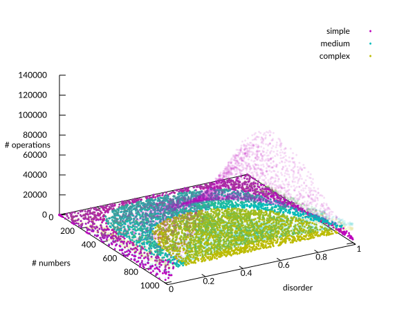
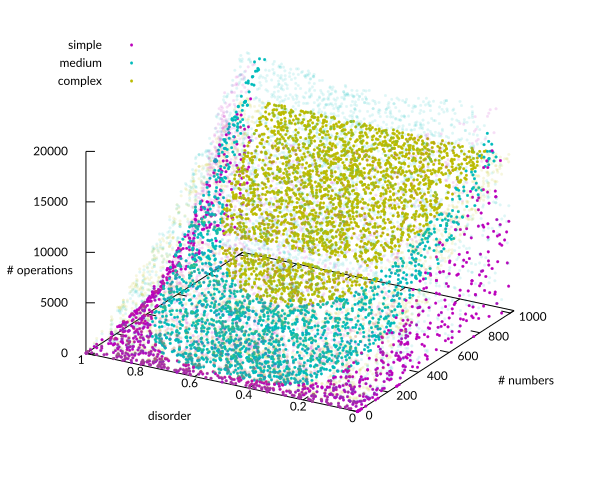
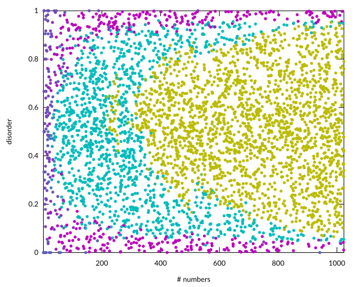
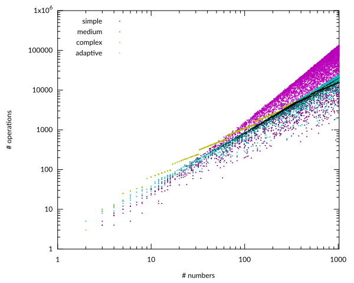

# 🔀 `push_swap_analyzer`

*by Matthias Sars, <msars@student.42berlin.de>*

## Description

A statistical analyzer script for the project `push_swap` from the 42 core curriculum (version 1.1 in the new 2026 curriculum).

## Instructions

Run with
```
./push_swap_analyzer.sh [-n <# points>] [-o <filename>] <push_swap path>
```
It appends data to the file given by the `-o` flag. The number of data points is given by the `-n` flag. Defaults are: `-n`: 256; `-o`: `data.csv`. You have to give the path to your `push_swap` program.

I then passes the data to a Gnuplot script which produces a four graphs.

(No need to `make` the helper programs; this is done inside the script.)

You can also process the generated data any way you wish, and feel free to adapt the scripts to your needs.

### Bash Script & Data

In the script `push_swap_analyzer.sh`, first a sequence is generated with a random size and and a random disorder. (See below in the Helper Programs section). `push_swap` sorts this sequence using all four strategies, and the number of operations is counted. This gives a data point that contains:
1. the size of the sequence,
2. the disorder (between 0 and 1)
3. number of operations for the simple strategy,
4. number of operations for the medium strategy,
5. number of operations for the complex strategy,
6. number of operations for the adaptive strategy.

The data is stored in CSV format: the values are separated by commata, the data points by newlines.

### Plots

The Gnuplot script `plots.gp` generates a few graphs.

The first two plots are 3D plots which can look something like:




The three strategies are plotted in three colours with transparent dots. The adaptive strategy is plotted with opaque dots. The only difference between the two plots is the scaling of the z axis and the orientation of the xy plane.

The third plot shows the minimum number of operations for each sequence (using the same colour coding as above). The intention of this one is to come op with good threshold values for the adaptive strategy.



The last plot shows the number of operations against the sequence length on a log-log scale for the four strategies. This is to get a feel of the big-O behaviour of the different strategies.



### Helper Programs

#### `generate_seq`

```
./generate_seq [-o <filename>] [-n <size>] [-m <maximum size>] [-d <disorder>]
```

This generates a sequence and prints it to `stdout` and appends the size and disorder numbers to the file given by the `-o` flag, or `stderr` if no filename is given. (Both followed by a comma.)

The sequence size is either given by the `-n` flag, or a random number up to the number given by the `-m` flag. This is 1024 by default.

The numbers in the sequence range from 0 to size - 1, without duplicates.

You can set a disorder number (between 0 and 1) with the `-d` flag. The program will try to match this number. By default, a random disorder number is chosen. Note that this is not the same as generating a random sequence. (If you want a randomly shuffled sequence, you can set `-d .5`.)

#### `count_ps_ops`

```
./count_ps_ops [-o <filename>] sequence
```

This reads the push_swap operations from `stdin` and applies them to the given sequence. If the sorting is correct, it appends the number of operations (followed by a comma) to the file given by the `-o` flag, or prints it to `stdout` if no filename is given. It it doesn't check out, it prints `KO,`.
